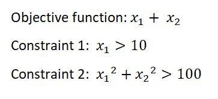

# Optimization
This Project Minimize Non-Linear Functions

## Definition

This Project Minimize Non-Linear Functions with Two constraints  using Gekko Library with python.

In this project I worked on this Objective function:

Here is the itertions values:

### Dependencies

#### install this libraries:
- Gekko

